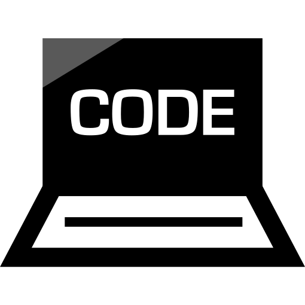

 I currently offer mock interviews! **[Schedule now!](https://calendly.com/beijie/1-1-session)**

# Mock Technical Interviews
- **Write better code** that passes the coding interviews
- **Tell better stories** that passes behavioral interviews
- **Create better designs** that passes System Design interviews

> ### Ready to ace your next technical interview?
> <a href="https://calendly.com/beijie/1-1-session" class="btn btn--success">Schedule your session now!</a>
<!-- >  **[Schedule your session now!](https://calendly.com/beijie/1-1-session)** -->

## Why mock technical interviews?

Got an interview at your dream company coming up? Worried about failing it and cannot retry until the next year? Did you know that when tech companies reject you they do not offer ANY feedbacks?

Most candidates don't fail because of lack of studying, they fail because they don't know *where* to study.

Here is how I can help. I will give you an experience as close to the real interview as possible, and identify any weaknesses so you could improve on. Would you rather fail the real interview to lose out on a six-figure offer or learn from a mock interview? **If you understand where you could fail, you will improve fast.**


<!-- <a href="https://www.fiverr.com/beijiez/do-a-mock-fang-phone-interview#reviews" class="btn btn--info">Read More</a> -->
<a href="/reviews" class="btn btn--info">Read More</a>

## Why did I offer this?

Coding interviews can be daunting. Once, that was me, I was awful at them. I would go through weeks worth of interviews only to receive rejection emails starting with *"Unfortunately ..."*. I didn't know what made me fail, nor how to improve on the next one. 

Long story short: I got better. I have passed interviews and gotten offers from some of the big giants such as Meta, Google, Meta(Facebook), Microsoft, Amazon, Linkedin, Bloomberg, Peloton, Palantir, and more. 

But I learned the hard way. There are skilled software engineers can learn to improve their technical interviews - in 3 dimensions of story telling, coding in ambiguity, and thinking out loud. These skills are agnostic to programming educational background, framework or language. **But no interviewers or recruiters will reveal them to you, until now.**


<a href="/reviews" class="btn btn--info">Read More</a>
<!-- <a href="https://www.fiverr.com/beijiez/do-a-mock-fang-phone-interview#reviews" class="btn btn--info">Read More</a> -->

## Who's the mock interviewer?

I'm [Beijie](https://www.youtube.com/c/BetterLogic). I've conducted and participated over 100 technical interviews in my career. During my 3 years at [Amazon Web Services](https://aws.amazon.com/), I was an active interviewer and have provided detailed feedbacks to the hiring panel for over a few dozens of Software Engineer interviews. If you liked my YouTube videos on my story telling, you're sure to love this mock interview.

This is an **personalized** session by yours truly. **I have first-hand experience on the topics I cover.** You won't find this information in technical interview documentation or guidelines you've seen anywhere else.


<a href="/reviews" class="btn btn--info">Read More</a>
<!-- <a href="https://www.fiverr.com/beijiez/do-a-mock-fang-phone-interview#reviews" class="btn btn--info">Read More</a> -->

> ### Ready to ace your next technical interview?
> <a href="https://calendly.com/beijie/1-1-session" class="btn btn--success">Schedule your session now!</a>
